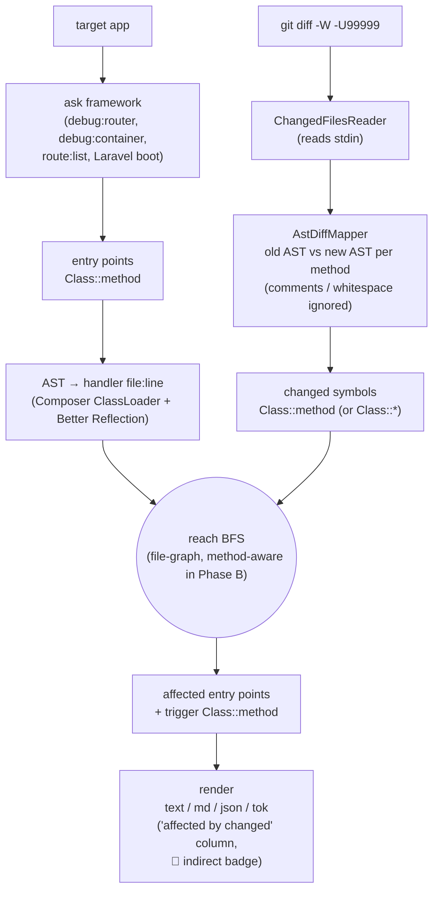

# watson

> PR blast-radius analyzer for PHP. Standalone dev-only CLI that introspects Symfony / Laravel apps from the outside. Reports which routes, commands, jobs, message handlers, and tests a diff actually reaches.

[](https://github.com/HellPat/watson/actions/workflows/ci.yml)
[](https://packagist.org/packages/hellpat/watson)
[](LICENSE)

```bash
composer require --dev hellpat/watson
git diff -W -U99999 origin/main...HEAD | vendor/bin/watson blastradius --format=tok
```

watson does not shell out to git. You pipe a unified diff in, watson tells you which framework entry points are reached — at **method** granularity, with comment-only and whitespace-only edits dropped at the AST layer. `-W` keeps each changed method whole inside the hunk; `-U99999` makes the hunk carry the full file so watson can AST-diff the two halves in memory.

---

## Output formats

Same data, four shapes. Pick the one that fits the consumer.

### `--format=text` (default — human terminal)

```
=====================================================================
watson php symfony (root: /abs/path)
=====================================================================

[list-entrypoints]

  3 entry point(s):
    - symfony.route            home              App\Controller\HelloController::home
    - symfony.command          app:ping          App\Command\PingCommand::execute
    - symfony.message_handler  App\Message\Ping  App\MessageHandler\PingHandler::__invoke
```

### `--format=md` (markdown for PR descriptions / LLM prompts)

````markdown
# watson — php symfony

_tool watson v0.3.0_

Root: `/abs/path`

## list-entrypoints
_v0.3.0_

**3 entry points**

| kind | name | handler |
|---|---|---|
| `symfony.route` | `home` | `App\Controller\HelloController::home` (`src/Controller/HelloController.php:12`) |
| `symfony.command` | `app:ping` | `App\Command\PingCommand::execute` (`src/Command/PingCommand.php:15`) |
| `symfony.message_handler` | `App\Message\PingMessage` | `App\MessageHandler\PingHandler::__invoke` (`src/MessageHandler/PingHandler.php:13`) |
````

### `--format=json` (machine contract)

```json
{
  "tool": "watson",
  "version": "0.3.0",
  "language": "php",
  "framework": "symfony",
  "context": {"root": "/abs/path"},
  "analyses": [
    {
      "name": "list-entrypoints",
      "version": "0.3.0",
      "ok": true,
      "result": {
        "entry_points": [
          {
            "kind": "symfony.route",
            "name": "home",
            "handler_fqn": "App\\Controller\\HelloController::home",
            "handler_path": "/abs/path/src/Controller/HelloController.php",
            "handler_line": 12,
            "source": "runtime",
            "extra": {"path": "/", "methods": ["GET"]}
          }
        ]
      }
    }
  ]
}
```

### `--format=tok` (token-optimized for LLM pipes)

Tab-separated, no JSON keys, no whitespace padding. Header lines start with `#`. Per-row layout: `kind \t name \t handler_fqn \t relative/path:line \t extra` (extra is HTTP-method + path for routes, message FQN for handlers, empty otherwise).

```
# watson 0.3.0 list-entrypoints php/symfony root=/abs/path
# entrypoints=3
# kinds: sc=symfony.command smh=symfony.message_handler sr=symfony.route
# fields: kind\tname\thandler\tpath:line\textra
sr	home	App\Controller\HelloController::home	src/Controller/HelloController.php:12	GET /
sc	app:ping	App\Command\PingCommand::execute	src/Command/PingCommand.php:15	
smh	App\Message\PingMessage	App\MessageHandler\PingHandler::__invoke	src/MessageHandler/PingHandler.php:13
```

Roughly half the token cost of pretty-printed JSON.

---

## Recipes

Each block below is a description followed by the command. All examples assume `composer require --dev hellpat/watson` is done.

### Pre-merge — review prompts piped to an LLM

```bash
# 1. Auto-review focused only on what changed
#    LLM is told the affected entry points; flags risky areas.
git diff -W -U99999 origin/main...HEAD | vendor/bin/watson blastradius --format=tok | llm \
  --system "Review this PR. Focus only on the affected entry points listed below.
Flag anything risky around auth, money handling, or user-visible behaviour."


# 2. Generate a manual testing guide
#    Turns the blast radius into a concrete click-through checklist for QA.
git diff -W -U99999 origin/main...HEAD | vendor/bin/watson blastradius --format=tok | llm \
  --system "You are a senior dev. Given these affected entry points, write a
concise manual testing guide: list the scenarios a reviewer must click through,
the edge cases most likely to break, and any data shape that needs verifying."


# 3. Coverage gap check — is the change covered by e2e / feature tests?
#    `--scope=all` includes phpunit.test entries so the LLM can cross-reference.
git diff -W -U99999 origin/main...HEAD | vendor/bin/watson blastradius --scope=all --format=tok | llm \
  --system "The tok output lists affected entry points (routes / commands / jobs /
message handlers) AND every phpunit.test in the repo. Cross-reference: which affected
entry points have at least one test that exercises them, and which don't?
Output a markdown table; flag gaps as 'NEEDS COVERAGE'."
```

> For a plain list of affected routes / commands / risk surface, the
> `--format=tok` (or `text` / `md`) output is the answer on its own — no
> LLM needed. Pipe to an LLM only when you want something the raw output
> can't give you: subjective judgement (risk, regression severity),
> cross-referencing with an external source (tests, coverage,
> observability), or written prose (testing guides).

### Post-release — observability MCP correlation

After a deploy, pipe the **just-shipped** entry points into an LLM that has an observability MCP server wired up — e.g. [Better Stack MCP](https://betterstack.com/docs/getting-started/integrations/mcp/) (`claude mcp add betterstack --transport http https://mcp.betterstack.com`). The LLM gets the surface that changed *and* live metrics — it can correlate the two without you copy-pasting route names into a dashboard.

```bash
# 1. Latency regression on routes that shipped in the last release
#    Diffs two release tags so you only ask about routes that actually changed.
git diff -W -U99999 v1.4.0..v1.5.0 | vendor/bin/watson blastradius --scope=routes --format=tok \
  --base=v1.4.0 --head=v1.5.0 | llm \
  --system "These routes shipped in v1.5.0. Use Better Stack MCP:
for each route, query p50 / p95 latency since the deploy timestamp
and compare to the previous 24h baseline. Flag any route whose p95
grew >20% or whose error rate doubled."


# 2. Error / exception regression after deploy
#    Wider scope so jobs and message handlers are also checked for new exceptions.
git diff -W -U99999 v1.4.0..v1.5.0 | vendor/bin/watson blastradius --format=tok \
  --base=v1.4.0 --head=v1.5.0 | llm \
  --system "These entry points (routes / commands / jobs / message handlers)
shipped in v1.5.0. Use Better Stack MCP error tracking to:
- list new exception classes seen on any affected handler since deploy,
- count occurrences vs the prior 24h,
- group by handler FQN and rank by impact."


# 3. Open incidents touching the changed surface
#    Uses list-entrypoints (the full registry) since incidents may not align
#    with a specific release window.
vendor/bin/watson list-entrypoints --scope=routes --format=tok | llm \
  --system "Use Better Stack MCP to list all currently-open incidents.
For each incident, identify which (if any) of the entry points below
is involved. Output a markdown table mapping incident → affected
entry point with a one-line summary."
```

---

## Install

```bash
composer require --dev hellpat/watson
```

No bundle, no service provider, no `config/bundles.php` entry. watson auto-detects Symfony vs Laravel by walking up from CWD looking for `bin/console` or `artisan`.

**Requirements:** PHP 8.4+. Symfony 6.4 / 7.x / 8.x or Laravel 10 / 11 / 12. `git` is *not* a watson dependency — watson only reads the diff you pipe in. If your diff source is git, you'll have it for that reason.

---

## Commands

### `watson blastradius`

Reads a unified diff from stdin and reports which entry points reach the changed methods. watson does not run git; the caller picks the diff source. There is **one** input shape — looser modes (name-only, explicit file lists) were removed so the engine has a single contract to support.

```bash
git diff -W -U99999 origin/main...HEAD | watson blastradius --format=tok
```

`-W` expands every hunk to the whole function it touches; `-U99999` pads context to ∞ so the hunk carries the full file. watson reconstructs old + new file content in-memory from the diff, AST-parses both halves, and hashes each `Class::method` body (docblocks + comments stripped, whitespace normalised). Only methods with a different hash become `ChangedSymbol`s — comment-only and whitespace-only edits never reach the reach engine.

Variants of the same pipe:

- **Staged-only:** `git diff --cached -W -U99999 | watson blastradius --format=tok`
- **Two-tag delta:** `git diff -W -U99999 v1.4.0..v1.5.0 | watson blastradius --format=tok`

When run with no pipe (interactive shell), watson exits with a usage hint instead of silently producing zero results.

Each affected entry point comes back with an **`affected by changed`** column listing the trigger `Class::method` symbols. Reach kind is one of:

- `🎯 direct` — the entry point's own handler file holds a changed symbol.
- `🔗 indirect` — the handler reaches a changed file through its imports, `new`, static calls, or type hints. The reverse-BFS is unbounded by default (the call graph saturates on its own); set `--max-depth=N` (`N >= 1`) to truncate.

#### Flags

| flag | default | what it does |
| --- | --- | --- |
| `--format=text\|md\|json\|tok` | `text` | Output shape. `md` is tuned for PR descriptions / LLM prompts; `json` is the machine contract; `tok` is tab-separated for token-cheap LLM piping. |
| `--scope=routes\|all` | `all` | `routes` skips commands / jobs / message handlers / tests. Faster startup, smaller signal. |
| `--max-depth=N` | `0` (unbounded) | Hops the reverse-BFS walks from each entry-point handler before stopping. `0` = let the call graph saturate; set `N >= 1` to tighten the signal. |
| `--app-env=ENV` | `dev` | Value passed to `bin/console` / `artisan` when collecting routes. |
| `--project=PATH` | walks up from `cwd` | Force the project root rather than autodetecting. |
| `--base=REF` / `--head=REF` | none | Cosmetic labels shown in the rendered envelope so consumers can correlate output to a diff range. |

### `watson list-entrypoints`

Snapshot every entry point the framework has registered: routes, commands, message handlers, jobs (Laravel), tests. Same flags as `blastradius`, minus the diff-input one.

### `watson <cmd> --help`

```
$ watson blastradius --help

Description:
  Report which routes, commands, jobs, and listeners are reached by the
  unified diff piped on stdin.

Usage:
  blastradius [options]

Options:
      --base=BASE          Cosmetic label shown as the diff base in rendered output.
      --head=HEAD          Cosmetic label shown as the diff head in rendered output.
      --project=PROJECT    Project root (defaults to walking up from CWD).
      --format=FORMAT      text | md | json | tok [default: "text"]
      --scope=SCOPE        routes | all [default: "all"]
      --app-env=APP-ENV    APP_ENV passed to bin/console / artisan [default: "dev"]
      --max-depth=MAX-DEPTH  BFS hops the indirect-reach pass walks. `0` = unbounded [default: 0]
```

```
$ watson list-entrypoints --help

Description:
  Snapshot every route, command, job, message handler, and test the framework
  has registered.

Usage:
  list-entrypoints [options]

Options:
      --project=PROJECT  Project root (defaults to walking up from CWD)
      --format=FORMAT    text (human terminal) | md (PRs/LLMs) | json (machine)
                         | tok (token-optimized for LLM pipes) [default: "text"]
      --scope=SCOPE      routes (cheapest) | all (+ commands / jobs / message
                         handlers / tests) [default: "all"]
      --app-env=APP-ENV  APP_ENV passed to bin/console / artisan [default: "dev"]
```

---

## How watson reads your app

| kind                       | source                                                                                                |
| ---                        | ---                                                                                                   |
| `symfony.route`            | `bin/console debug:router --format=json`                                                              |
| `symfony.command`          | `bin/console debug:container --tag=console.command --format=json` (vendor filtered)                   |
| `symfony.message_handler`  | `bin/console debug:container --tag=messenger.message_handler --format=json` (vendor filtered, message inferred via reflection on the handler's first param when the tag's `handles` is null) |
| `laravel.route`            | `php artisan route:list --json`                                                                       |
| `laravel.command`          | inline `php -r` runner that boots Laravel and dumps `Artisan::all()` (vendor filtered)                |
| `laravel.job`              | AST scan of `app/Jobs/` for `ShouldQueue` implementers                                                |
| `phpunit.test`             | AST scan of the project's `autoload-dev.psr-4` roots for `PHPUnit\Framework\TestCase` subclasses     |

watson is a CLI binary, not a bundle/provider. AST scans go through [`nikic/php-parser`](https://github.com/nikic/PHP-Parser) — watson never `require_once`s your app's source. (Earlier versions used [`roave/better-reflection`](https://github.com/Roave/BetterReflection) for per-class inheritance walks; that turned out to be a perf trap on large Laravel apps, so discovery is now hash-map BFS over a single-pass AST class index.)

---

## Pipeline



---

## License

MIT. See [LICENSE](LICENSE).
